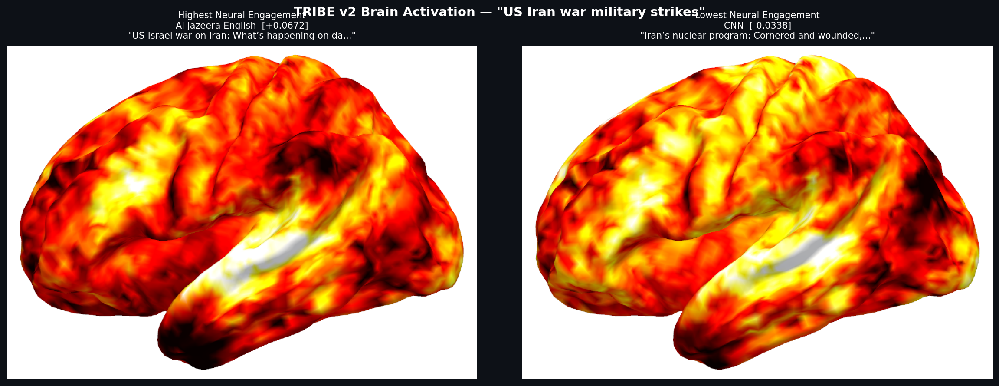
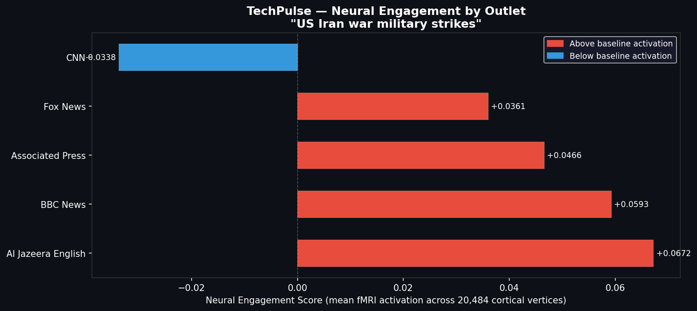

# TechPulse

A neural RAG pipeline that re-ranks news coverage by predicted brain engagement using Meta's TRIBE v2 foundation model.

Standard RAG retrieves the most semantically similar content. TechPulse adds a second layer — after retrieval, each article is scored by TRIBE v2, which predicts how strongly it would activate the human brain. The result is coverage ranked not just by relevance, but by neural engagement.

## How It Works

1. NewsAPI fetches top headlines from 6 outlets (Al Jazeera, BBC, CNN, Fox News, AP, Reuters)
2. Articles are chunked, embedded via sentence-transformers, and stored in Pinecone
3. A user query retrieves the most semantically relevant article per outlet
4. TRIBE v2 runs fMRI prediction on each headline — producing a 20,484-vertex cortical activation map
5. Outlets are ranked by mean brain activation score
6. Claude Sonnet generates a media intelligence analysis of the framing differences

## Brain Activation Comparison

TRIBE v2 predicted cortical response for the query "US Iran war military strikes":



Al Jazeera's "Day 30 of attacks" framing produces significantly higher cortical activation than CNN's nuclear policy analysis — consistent with the difference between immediate conflict reporting and deliberative strategic framing.

## Outlet Scores



## Stack

- Meta TRIBE v2 — neural re-ranking via fMRI prediction
- Pinecone — vector store for semantic retrieval
- sentence-transformers (all-MiniLM-L6-v2) — embedding model
- Claude Sonnet — outlet framing analysis
- NewsAPI — live news ingestion
- FastAPI — TRIBE inference microservice
- Jupyter — demo notebook

## Running Locally

```bash
# 1. Install dependencies (Python 3.11 required)
python3.11 -m venv .venv311
source .venv311/bin/activate
pip install -e ~/tribev2
pip install -r requirements.txt

# 2. Set environment variables
cp .env.example .env
# Add PINECONE_API_KEY, ANTHROPIC_API_KEY, NEWS_API_KEY

# 3. Start TRIBE inference server
uvicorn tribe_server:app --port 8000

# 4. Run the demo notebook
jupyter notebook techpulse_demo.ipynb
```

## About TRIBE v2

TRIBE v2 is a foundation model from Meta FAIR released March 2026, trained on 1,115 hours of fMRI recordings from 700+ volunteers. It predicts whole-brain responses to text, audio, and video stimuli at 20,484-vertex cortical resolution. TechPulse uses it as a re-ranking layer — treating predicted neural engagement as a signal for how cognitively stimulating a piece of content is to the human brain.
